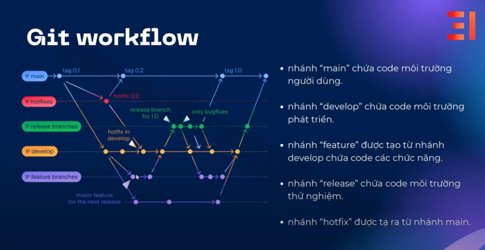

# Linux
### INSTALL CENTOS
1. Cau hinh card mang co dinh

File /etc/netplan/00-installer-config.yaml default
``` 
# This is the network config written by 'subiquity'
network:
  ethernets:
    ens33:
      dhcp4: true
  version: 2
```
Change to ====>
``` 
/etc/netplan/00-installer-config.yaml
# This is the network config written by 'subiquity'
network:
  ethernets:
    ens33:
      dhcp4: false
      addresses: [192.168.157.128/24]
      gateway4: 192.168.157.2
  version: 2
```


```
tiennnv65 comment
--------
file cau hinh duoc viet duoi dang cau truc yaml
ens: Ethernet Network Switch
wlan: wireless local area network
convention khi dat ten cua card mang:
tiep sau cac loai card mang nhu ens/wlan la cac ky hieu chu va so
Numeric identifier: 33 y chi la card mang ethernet thu 33 cua trong may
additional characters: 
Lưu ý: khi dùng máy ảo mode NAT network adapter
  => Cần check default gateway để điều chỉnh cho đúng
```

### QUYEN TRUY CAP TRONG LINUX
1. Tao user trong linux
```
# adduser
# useradd 
# usermod -aG devops2 manhnv1
# chmod g=rwx ./data (Co 3 option ugo dai dien cho user, group, other)

----
Khi nao user thi se tao mot group tuong ung vs user do
```
### TU DUY TRIEN KHAI DU AN
1. Tư duy triển khai hệ thống

```
1. Công cụ là gì
2. File cấu hình ở đâu
3. Làm sao để build
4. Run như thế nào?
```

2. Tư duy bảo vệ hệ thống
 
```
1. Thư mục làm việc riêng
2. User cho dự án riêng
```


2. Build du an frontend vuejs
   
```
1. Cai cong cu
  Cai nodejs (tuong duong jdk)
  apt install nodejs
  Cai cong cu quan ly goi cua js
  apt install npm

2. Cai cac thu vien di kem
  npm install
3. build
  npm run build
3. Run
  Thong thuong vs du an FE thi co 3 cach de chay duoc du an len
  Cach 1: Su dung webserver (VD: nginx)
    dfdf
  Cach 2: Chay bang service
    npm run serve
  Cach 3: Chay bang vm2

  Cach 4: npm run serve
```

3. Huong dan dung nginx

<u>Buoc 1</u>: Cai dat nginx

    apt-get install nginx

<u>Buoc 2</u>:  Cau hinh

File cau hinh cua nginx duoc dat tai ***/etc/nginx***

VD1: 
    Thay doi port mac dinh (80 -> 8080)

```
/etc/nginx/sites-available/default 

server {
        listen 8080 default_server;
        listen [::]:8080 default_server;
```
VD2: 
    Tro den mot du an frontend

```
/etc/nginx/conf.d/todolist.conf

server {
  listen 8081;
  root /path/to/project/todolist/dist/;
  index index.html;
  try_files $uri $uri /index.html;
}
```
Note:

```
+ De test sytax cua nginx thuong dung lenh
      nginx -t (t la test)
+ De nginx chay duoc du an frontend cua ban thi phai add user cua nginx vao trong group cua user chay du an
      user nginx: www-data
      user du an: todolist
      usermod -aG todolist www-data 
+ restart 
      systemctl restart nginx
+ reload lai config (Khong anh huong den cac service khac cung dang dung nginx)
      nginx -s reload
```


4. Trien khai du an frontend react
   
```
1. tao user vision
  adduser vision
2. trien khai duoi dang service cua linux
  vi /lib/systemd/system/vision.service
  [Service]
  Type=simple
  User=vision
  Restart=on-failure
  WorkingDirectory=/home/vision/vision_FE_java/vision/
  ExecStart=npm run start -- --port=3000
  ~

  Sau khi edit xong file vision.service                                        
  systemctl daemon-reload
  systemctl start vision
```
4. Trien khai du an backend nodejs vs PM2

    PM2 la cong cu trien khai app tren moi truong production.
   
```
Sample file config mau cua pm2

*** file ecosystem.config.js***


module.exports = {
  apps : [{
    name: 'VISION_PROJECT',
    script: 'npm start',
    instances: 4,
    max_memory_restart: '2G',
    env: {
      NODE_ENV: 'development'
    },
    env_production: {
      NODE_ENV: 'production'
    }
  }]
}; 

********
Dung tai thu muc project va Chay lenh pm2 start


*******
Cac lenh pm2 
pm2 stop <app-name>: Stop the web server process.
pm2 restart <app-name>: Restart the web server process.
pm2 delete <app-name>: Remove the web server process from PM2.
pm2 list: List all processes managed by PM2, including your web server.
pm2 describe <app-name>: Get detailed information about a specific process.

```

5. Trien khai du an Java co ket noi mariadb

    Du an co ten la shoeshop

Cai dat jdk   => java --version
Cai dat maven => mvn --version

```
**********
Cai dat mariadb:
  apt install mariadb-server -y
  config:
    50-server.cnf
**********
Tao user va grant quyen
root@sv1:/etc/mysql/mariadb.conf.d# mysql -u root 

MariaDB [(none)]> create user 'shoeshop'@'%' identified by 'shoeshop';
Query OK, 0 rows affected (0.000 sec)

MariaDB [(none)]> grant all privileges on shoeshop.* to 'shoeshop'@'%';
Query OK, 0 rows affected (0.001 sec)

MariaDB [(none)]> flush privileges;
Query OK, 0 rows affected (0.001 sec)


****
Chay script tao bang bieu database
source /home/shoeshop/shoeshop-ecommerce/shoeshop/shoe_shopdb.sql

```

Change size of volume
```
archives  pkgcache.bin  srcpkgcache.bin
root@sv1:/var/cache/apt# lsblk
NAME                      MAJ:MIN RM  SIZE RO TYPE MOUNTPOINT
fd0                         2:0    1    4K  0 disk 
loop0                       7:0    0 63.3M  1 loop /snap/core20/1828
loop1                       7:1    0 39.1M  1 loop /snap/snapd/21184
loop2                       7:2    0 63.9M  1 loop /snap/core20/2182
loop3                       7:3    0 91.9M  1 loop /snap/lxd/24061
loop4                       7:4    0 38.8M  1 loop /snap/snapd/21465
sda                         8:0    0   30G  0 disk 
├─sda1                      8:1    0    1M  0 part 
├─sda2                      8:2    0  1.8G  0 part /boot
└─sda3                      8:3    0 18.2G  0 part 
  └─ubuntu--vg-ubuntu--lv 253:0    0   10G  0 lvm  /
sr0                        11:0    1 1024M  0 rom  
sr1                        11:1    1  1.4G  0 rom  

Ban dau / dang mount vao /dev/mapper/ubuntu--vg/ubuntu--lv co size bang 10G

Bi day: KEYWORD
"Change size of /dev/mapper/ubuntu--vg-ubuntu--lv"


Sau do dieu chinh 
lvdisplay /dev/ubuntu-vg/ubuntu-lv
lvresize -L +10G /dev/ubuntu-vg/ubuntu-lv
lvdisplay /dev/ubuntu-vg/ubuntu-lv
sudo fdisk -l
df -h
```

# GIT


1.  INSTALL GITSERVER
  
```
Link: https://packages.gitlab.com/gitlab/gitlab-ee/packages/ubuntu/bionic/gitlab-ee_15.1.4-ee.0_amd64.deb

sudo apt-get install gitlab-ee=15.1.4-ee.0
```
2. GIT WORKFLOW



