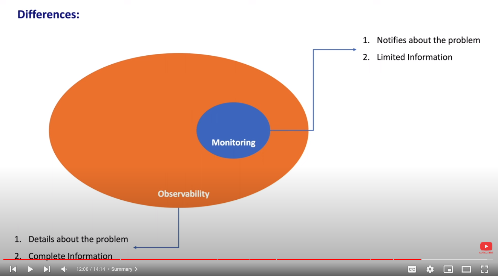
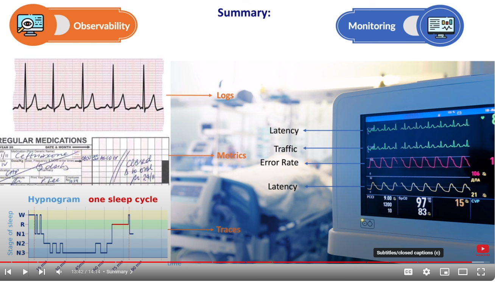
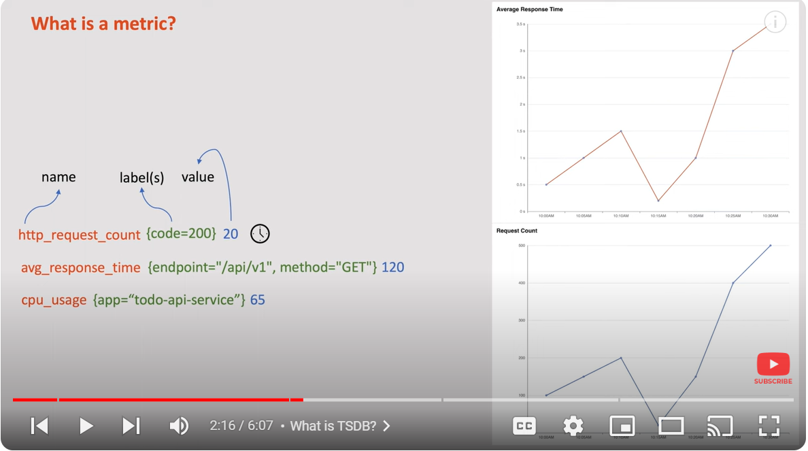
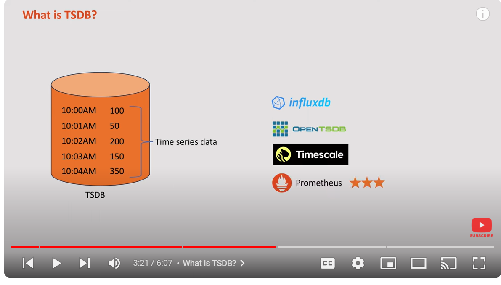
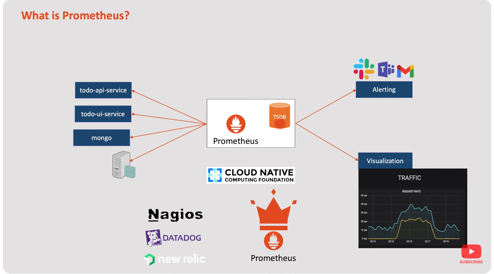

# PROMETHUS

Link of course: 
https://www.youtube.com/watch?v=QNTxijK0qxk&list=PLrMP04WSdCjrL4OBnaqXRy8X3XEd7ZrKf&index=2

# Table of content 
- [Observability vs. Monitoring](#observability-vs-monitoring)
- [Introduce the Promethus](#introduce-the-promethus)
- [Promethus architecture](#promethus-architecture)

## Observability vs Monitoring

Tool help us to track the  health of invidual component include: database, network, infra-structure

To monitoring effectively we need to know:

4 golden signal:
- latency: time to take for requests to travel from the client to server and back
- traffic: number of requests system receive over specific period
- errors: percentage of requests resulting in errors, such as 404 Page not found or 500  internal server Error
- saturation: Measure resource utilization, including CPU, mem, disk space.

Observablity: (O11y) Giong vs cach viet tat K8s

3 pillars of Observability:
- Logs: Provide a chronological record of events, transactions within a system
- Traces: Help track the flow of requests through various services and component of a service.
- Metrics: Quantitative measurements that offer a snapshot of a system's performance overtime.
    Promethus collect information from many source...

Observability vs Monitor:
Monitor is smaller scope of Observability

 

 

## Introduce the Promethus

### Intro
In the above section, we have discussed about observability and monitor.
Promethus is tool to observer, monitor and escalate the issue in the system.

### What is metric

### What is TSDB (time series)
TSDB stands for Time Series Database. It is a type of database that specializes in storing and managing data points or events that are associated with timestamps or time intervals. TSDBs are designed to efficiently handle time-based data, such as sensor readings, metrics, financial data, or any data that changes over time.

### what is promethus

### Fact about Promethus

Promethus is used in Cloud enviroment.
several client was install like datadog, nagios, new relic 

# Promethus architecture
## intro
## Promethus server
## client Libraries
## Exporter
## Push gateway 
## Service Discovery
## PromQL
## Alert Manager
