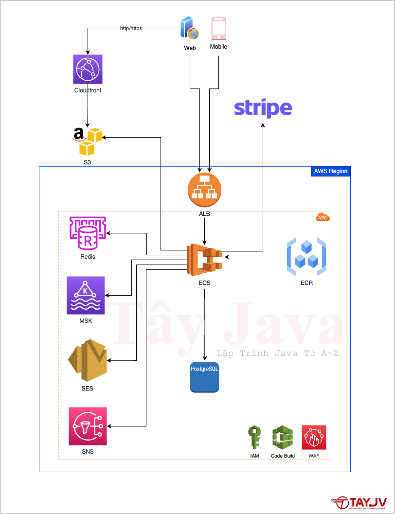
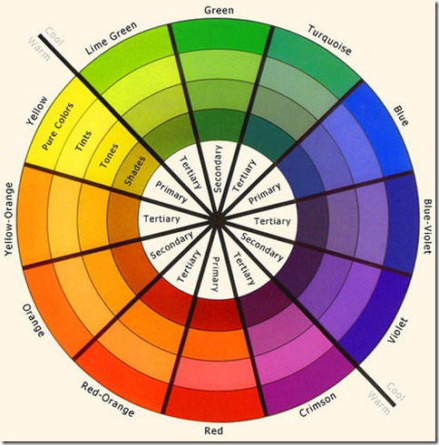
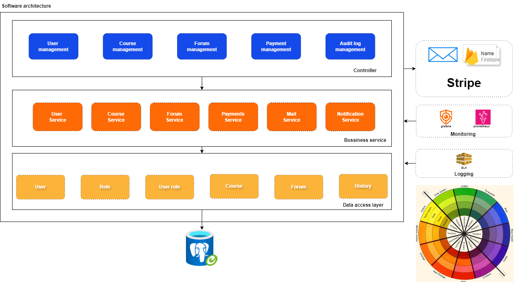

# Lập trình Java Backend Full Steps

## Course Overview

<table>
  <tr>
    <th>Description</th>
    <th>Skills</th>
    <th>Tools</th>
  </tr>
  <tr>
    <td>
    <details>
    <summary>Viết tài liệu đặc tả yêu cầu của dự án</summary>
    </details>
    <details>
    <summary>Thiết kế kiến trúc và mô hình phần mềm</summary>
    </details>
    <details>
    <summary>Thiết kế giao diện UI/UX với figma</summary>
    </details>
    </td>
    <td>
    <details>
    <summary>Thành thạo kỹ năng DEBUG</summary>
    </details>
    <details>
    <summary>Validate và xử lý ngoại lệ</summary>
    </details>
    <details>
    <summary>Thiết kế giao diện UI/UX với figma</summary>
    </details>
    <details>
    <summary>Xây dựng chức năng xác thực và phân quyền cho User</summary>
    </details>
    <details>
    <summary>Xây dựng chức năng giám sát hệ thống</summary>
    </details>
          <details>
        <summary>Tạo project base chuẩn</summary>
      </details>
      <details>
        <summary>Thiết kế database chuyên nghiệp</summary>
      </details>
      <details>
        <summary>Thành thạo kỹ nẵng viết API chuẩn RESTful</summary>
      </details>
    </td>
    <td>
      <details>
        <summary>Xây dựng chức năng gửi email</summary>
      </details>
      <details>
        <summary>Xây dựng chức năng logging</summary>
      </details>
      <details>
        <summary>Build, đóng gói ứng dụng và push lên dockerhub</summary>
      </details>
      <details>
        <summary>Thiết lập CI/CD Pipeline với Jenkins</summary>
      </details>
    </td>
  </tr>
</table>

## Keyword
```java
UAT: User acceptance testing
CDN: Content Delivery Network
RDS proxy: Tương tự như connection pool (connection pool duoc quan ly boi ung dung, cai RDS nằm giữa nhiều ứng dụng có thể sử dụng được.)
VPC: vi
Henry ford: Những người cần thận mới làm ra các sản phẩm tốt
DAO: Data Access Object
DTO: Data Transfer Object
color contract: Mau co do tuong phan cao, 3 quy tac (Doi xung, lien ket, dong mau), clip 4
```

## Topics Covered

- Viết tài liệu của dự án
  - Viết tài liệu đặc tả yêu cầu
  - Subtopic 2
- Thiết kế hạ tầng để triển khai ứng dụng
  ...

## Viết tài liệu của dự án

Tài liệu đặc tả yêu cầu

  - Giới thiệu về hệ thống
  - Mục tiêu hệ thống
  - Các chức năng chính
  - Các yêu cầu phi chức năng

## Các lỗi phổ biến khi viết tài liệu

## Thiết kế hạ tầng để triển khai ứng dụng
Hạ tầng bao  gồm máy chủ, điều hòa...
### Quy trình phát triển PM:
- Viết tài liệu
- Planning
- Phát triển
- Build & package (sonarqueue, scan)
- Test 
  - Test, 
  - UAT (Du lieu tuong doi that) 
- Release


### Pipe line



### Thiết kế kiến trúc và mô hình ứng dụng

Quy tac mau tuong phan
- Chon cac mau trong bo (doi xung nhau, lien ke nhau)





Thiết kế một hệ thống mô hình monolithic



### Câu hỏi phỏng vấn:
```java
https://docs.google.com/spreadsheets/d/1QODcYmAyoOYHNfS7l7UPUQmZvs_LnqK4/edit?gid=353894476#gid=353894476
```
### Example 1: Title of the example

```java
// Code here
public class Example {
    public static void main(String[] args) {
        System.out.println("Hello, World!");
    }
}
```

### Example 2: Title of the example

```java
// Code here
public class AnotherExample {
    public static void main(String[] args) {
        System.out.println("Another example.");
    }
}
```

## Exercises

### Exercise 1: Description of the exercise

- Instructions
- Expected output

### Exercise 2: Description of the exercise

- Instructions
- Expected output

## Resources

- Links to relevant documentation.
- Links to helpful articles or tutorials.

## Further Reading

- Books
- Articles

